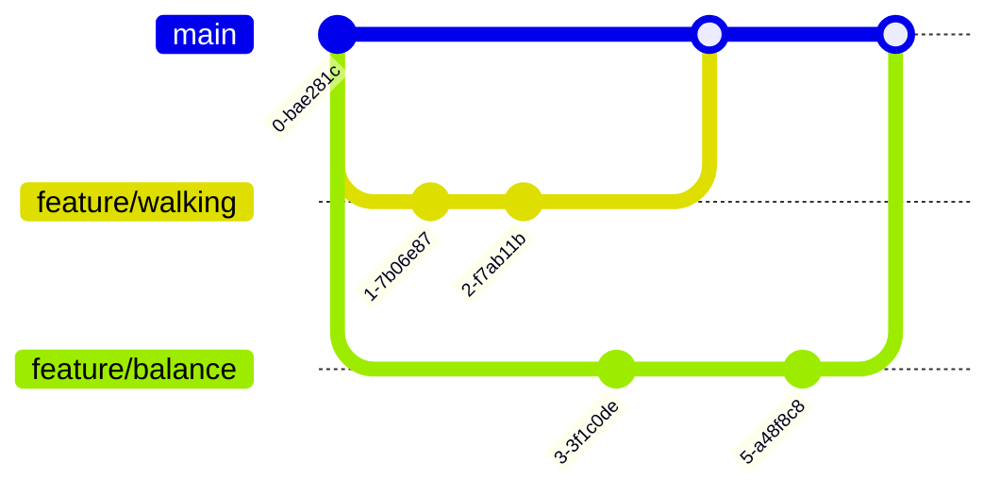

# 第4章：开发环境与工具链

> **本章导读**：工欲善其事，必先利其器。在人形机器人与具身智能的学习和研发中，一个稳定、高效的开发环境是成功的基石。本章将从零开始，手把手教你搭建完整的 Python 科学计算栈、MuJoCo 物理仿真环境、Git 版本控制工具，以及深度学习框架。无论你使用的是 Windows、macOS 还是 Linux，本章都会给出对应的操作指南。学完本章后，你将能独立配置一个从基础计算到强化学习的完整人形机器人开发环境。

**本章预估时间**：完整动手实操约 4-6 小时；纯阅读约 2 小时。

**章节导航**：

- [4.1 Python 科学计算栈](#41-python-科学计算栈4000字)
- [4.2 MuJoCo 安装与配置](#42-mujoco-安装与配置5000字)
- [4.3 Git 与版本控制](#43-git-与版本控制5000字)
- [4.4 项目结构与规范](#44-项目结构与规范4000字)
- [4.5 深度学习环境配置](#45-深度学习环境配置3000字)
- [4.6 实用开发工具推荐](#46-实用开发工具推荐2000字)
- [🛠️ 仿真实操：MuJoCo 完整入门](#️-仿真实操mujoco-完整入门1500字)
- [本章小结](#本章小结)
- [习题](#习题)
- [参考文献](#参考文献)

---

## 4.1 Python 科学计算栈（4,000字）

Python 之所以成为人工智能和机器人领域的主流语言，不仅仅因为语法简洁，更因为它背后庞大的科学计算生态。NumPy、Matplotlib、SciPy、Jupyter 等库构成了所谓的"Python 科学计算栈"（Python Scientific Stack）。本节我们将逐一攻破这些工具的核心用法。

### 4.1.1 NumPy 核心操作

NumPy（Numerical Python）是 Python 科学计算的基石。几乎所有更高层的库（包括 MuJoCo、PyTorch、Matplotlib）都在底层依赖 NumPy 的数组结构。

#### 安装 NumPy

如果你还没有安装 NumPy，请先执行：

```bash
pip install numpy
```

验证安装：

```bash
python -c "import numpy as np; print(np.__version__)"
```

你应该会看到类似 `1.26.4` 的版本号。

#### 数组创建

NumPy 的核心数据结构是 `ndarray`（N 维数组）。以下是最常用的创建方式：

```python
import numpy as np

# 从 Python 列表创建
a = np.array([1, 2, 3, 4, 5])
print(a)          # [1 2 3 4 5]
print(a.shape)    # (5,) —— 一维数组，5个元素
print(a.dtype)    # int64

# 二维数组（矩阵）
b = np.array([[1, 2], [3, 4], [5, 6]])
print(b.shape)    # (3, 2) —— 3行2列

# 特殊数组
zeros = np.zeros((3, 4))          # 全零矩阵
ones = np.ones((2, 3))            # 全一矩阵
eye = np.eye(4)                   # 4×4 单位矩阵
empty = np.empty((2, 2))          # 未初始化（垃圾值，速度快）
full = np.full((2, 3), 7)         # 全部填充为7

# 等间隔数组
x = np.arange(0, 10, 2)           # [0, 2, 4, 6, 8] —— 类似 range()
y = np.linspace(0, 1, 5)          # [0. , 0.25, 0.5, 0.75, 1. ] —— 5个等分点

# 随机数组（重要！常用于初始化神经网络权重）
np.random.seed(42)                # 固定随机种子，保证可复现
rand = np.random.rand(3, 3)       # [0,1) 均匀分布
randn = np.random.randn(3, 3)     # 标准正态分布
randint = np.random.randint(0, 10, (2, 5))  # [0,10) 整数均匀分布
```

> **💡 科普**：固定随机种子（`np.random.seed`）在科学计算中至关重要。它保证每次运行生成相同的"随机"数，使实验结果可复现。在人形机器人强化学习中，如果不固定种子，同一个算法跑两次可能得到完全不同的训练曲线，从而让你无法判断改进是否有效。

#### 索引与切片

NumPy 的索引规则和 Python 列表类似，但支持多维同时索引：

```python
arr = np.array([[1, 2, 3, 4],
                [5, 6, 7, 8],
                [9, 10, 11, 12]])

# 基本索引
print(arr[0, 0])      # 1 —— 第0行第0列
print(arr[1, 2])      # 7 —— 第1行第2列

# 切片 [start:stop:step]
print(arr[0:2, 1:3])  # 前两行，第1到第3列（不含3）
# [[2 3]
#  [6 7]]

print(arr[:, -1])     # 所有行的最后一列 -> [4, 8, 12]

# 布尔索引（条件筛选）
mask = arr > 5
print(arr[mask])      # [ 6  7  8  9 10 11 12]

# 花式索引（整数数组索引）
indices = [0, 2]
print(arr[indices])   # 第0行和第2行
```

#### 广播机制（Broadcasting）

广播是 NumPy 最强大的特性之一。它允许对不同形状的数组进行算术运算，而无需手动复制数据。

```python
a = np.array([1, 2, 3])        # shape: (3,)
b = np.array([[10], [20]])     # shape: (2, 1)

# 广播：a → (1, 3) → (2, 3)
#       b → (2, 1) → (2, 3)
c = a + b
print(c)
# [[11 12 13]
#  [21 22 23]]
```

广播的规则是：从尾部维度开始比较，要么相等，要么其中一个为 1，要么缺失。这个机制在 MuJoCo 和 PyTorch 中同样适用，理解它对你后续的代码编写至关重要。

**实用场景**：在人形机器人运动学中，你经常需要对所有关节进行相同的操作。比如给所有关节角度加上一个偏移量：

```python
joint_angles = np.array([0.1, 0.2, -0.1, 0.0, 0.05])  # 5个关节
offset = 0.01  # 标量
new_angles = joint_angles + offset  # 广播自动应用到所有元素
```

#### 线性代数基础

人形机器人涉及大量线性代数运算：旋转矩阵、坐标变换、雅可比矩阵等。

```python
A = np.array([[1, 2], [3, 4]])
B = np.array([[5, 6], [7, 8]])

# 矩阵乘法
C = A @ B                     # 推荐写法，Python 3.5+
C = np.dot(A, B)              # 等价写法

# 元素级乘法
D = A * B                     # 注意这与矩阵乘法不同！

# 转置
print(A.T)                    # [[1 3], [2 4]]

# 逆矩阵
A_inv = np.linalg.inv(A)

# 特征值和特征向量
eigenvalues, eigenvectors = np.linalg.eig(A)

# 解线性方程组 Ax = b
b = np.array([1, 2])
x = np.linalg.solve(A, b)     # x = [-3. ,  2.]

# 范数
norm = np.linalg.norm(np.array([3, 4]))  # 5.0 —— 欧几里得范数
```

> **⚠️ 注意**：在实际机器人代码中，尽量避免频繁求逆（`np.linalg.inv`），因为数值不稳定且计算量大。优先使用 `np.linalg.solve` 解线性方程组，或者用 `np.linalg.lstsq` 处理最小二乘问题。

#### 重塑与合并

```python
a = np.arange(12)                 # [0 1 2 ... 11]

# 重塑形状
b = a.reshape(3, 4)               # 3行4列
c = a.reshape(2, -1)              # -1 表示自动推断：2行6列

# 展平
flat = c.flatten()                # 返回拷贝
flat = c.ravel()                  # 返回视图（修改可能影响原数组）

# 合并
v1 = np.array([1, 2, 3])
v2 = np.array([4, 5, 6])
hstack = np.hstack((v1, v2))      # 水平拼接 [1 2 3 4 5 6]
vstack = np.vstack((v1, v2))      # 垂直拼接 [[1 2 3], [4 5 6]]

# 新增维度
col = v1[:, np.newaxis]           # (3,) → (3, 1)
row = v1[np.newaxis, :]           # (3,) → (1, 3)
```

### 4.1.2 Matplotlib 可视化

Matplotlib 是 Python 最经典的绘图库。虽然一些新工具（如 Plotly、Seaborn）在某些场景更便捷，但 Matplotlib 的灵活性和生态兼容性无可替代。

#### 折线图

```python
import matplotlib.pyplot as plt
import numpy as np

# 生成数据
x = np.linspace(0, 2 * np.pi, 100)
y_sin = np.sin(x)
y_cos = np.cos(x)

# 创建画布
plt.figure(figsize=(8, 4))

# 绘制
plt.plot(x, y_sin, label='sin(x)', color='blue', linestyle='-', linewidth=2)
plt.plot(x, y_cos, label='cos(x)', color='red', linestyle='--', linewidth=2)

# 装饰
plt.xlabel('x')
plt.ylabel('y')
plt.title('Sine and Cosine Functions')
plt.legend()
plt.grid(True, alpha=0.3)

# 显示
plt.tight_layout()
plt.show()
```

**在人形机器人中的应用场景**：训练曲线可视化。强化学习训练过程中，你需要绘制奖励曲线（reward curve）来判断算法是否收敛。

```python
# 假设我们有5次实验的奖励数据
episodes = np.arange(1, 101)
rewards_exp1 = np.random.randn(100).cumsum() + 50  # 模拟递增的奖励
rewards_exp2 = np.random.randn(100).cumsum() + 50

plt.figure(figsize=(10, 5))
plt.plot(episodes, rewards_exp1, label='Experiment 1', alpha=0.8)
plt.plot(episodes, rewards_exp2, label='Experiment 2', alpha=0.8)
plt.xlabel('Episode')
plt.ylabel('Total Reward')
plt.title('Training Curve')
plt.legend()
plt.grid(True, alpha=0.3)
plt.show()
```

#### 散点图

散点图常用于观察两个变量之间的关系，比如机器人关节角度与末端执行器位置的关系：

```python
# 生成随机散点
n_points = 200
x = np.random.randn(n_points)
y = 2 * x + 0.5 * np.random.randn(n_points)

plt.figure(figsize=(6, 5))
plt.scatter(x, y, alpha=0.6, s=30, c='purple', edgecolors='black', linewidth=0.5)
plt.xlabel('X')
plt.ylabel('Y')
plt.title('Scatter Plot with Linear Trend')
plt.grid(True, alpha=0.3)
plt.show()
```

#### 3D 图

MuJoCo 输出的往往是三维空间中的位置和姿态数据，3D 可视化可以帮助你直观理解。

```python
from mpl_toolkits.mplot3d import Axes3D

# 生成螺旋线数据
t = np.linspace(0, 4 * np.pi, 200)
x = np.cos(t)
y = np.sin(t)
z = t / 10

fig = plt.figure(figsize=(8, 6))
ax = fig.add_subplot(111, projection='3d')
ax.plot(x, y, z, label='3D Spiral', linewidth=2)

ax.set_xlabel('X')
ax.set_ylabel('Y')
ax.set_zlabel('Z')
ax.set_title('3D Trajectory')
ax.legend()
plt.show()
```

#### subplot 多子图

当你需要同时展示多个视图时，`subplot` 非常有用：

```python
fig, axes = plt.subplots(2, 2, figsize=(10, 8))
x = np.linspace(0, 10, 100)

axes[0, 0].plot(x, np.sin(x))
axes[0, 0].set_title('sin(x)')

axes[0, 1].plot(x, np.cos(x), 'r')
axes[0, 1].set_title('cos(x)')

axes[1, 0].plot(x, np.sin(x) * np.cos(x), 'g')
axes[1, 0].set_title('sin(x)cos(x)')

axes[1, 1].plot(x, np.sin(x)**2 + np.cos(x)**2, 'm')
axes[1, 1].set_title('sin²(x)+cos²(x) = 1')

plt.tight_layout()
plt.show()
```

> **📌 实用提示**：在 Jupyter Notebook 中，加上 `%matplotlib inline` 魔法命令可以使图表直接显示在单元格下方。如果你想要交互式图表，使用 `%matplotlib notebook`（Lab 中自动支持）。

### 4.1.3 Jupyter Notebook/Lab 交互式开发

Jupyter 是数据科学和机器人开发的"标配"交互式环境。它让你可以逐单元格执行代码、即时查看结果、嵌入图表和说明文字。

#### 安装与启动

```bash
# 安装 Jupyter Lab（推荐，Notebook 的升级版）
pip install jupyterlab

# 启动
jupyter lab

# 或者启动经典 Notebook
jupyter notebook
```

启动后浏览器会自动打开一个本地网页（默认 http://localhost:8888），你可以在其中创建和管理笔记本。

#### 常用快捷键与技巧

| 快捷键 | 作用 |
|--------|------|
| `Enter` | 进入编辑模式 |
| `Esc` | 退出到命令模式 |
| `A` | 在上方插入新单元格 |
| `B` | 在下方插入新单元格 |
| `DD` | 删除当前单元格 |
| `Shift+Enter` | 运行当前单元格并选中下一个 |
| `Ctrl+Enter` | 运行当前单元格 |
| `M` | 切换为 Markdown 单元格 |
| `Y` | 切换为 Code 单元格 |

#### 魔法命令 (Magic Commands)

```python
# 计时
%time sum([i**2 for i in range(100000)])
%timeit sum([i**2 for i in range(100000)])

# 查看变量内存占用
%whos

# 运行外部 Python 文件
%run standing_demo.py

# 嵌入 Matplotlib 图表
%matplotlib inline

# 调试（进入 pdb）
%debug
```

#### Notebook 的最佳实践

1. **命名规范**：使用有意义的文件名，如 `04-dev-env-numpy-tutorial.ipynb`
2. **按逻辑分段**：一个单元格做一件事，避免一个单元格写几百行
3. **清理输出**：提交到 Git 前使用 `Kernel → Restart & Clear Output` 清理输出，减少文件大小
4. **使用 Markdown 文档化**：每个主要部分前用 Markdown 写清楚目标和思路
5. **设置随机种子**：每个涉及随机数的单元格都设置 seed，保证可复现

### 4.1.4 虚拟环境管理

虚拟环境是 Python 开发的"最佳实践"。它为每个项目隔离依赖包，避免"这个项目要 A 版本，那个项目要 B 版本"的冲突。

#### venv（Python 内置）

Python 3.3+ 内置了 `venv` 模块，无需额外安装。

```bash
# 创建虚拟环境（在项目根目录下执行）
python -m venv venv

# 激活（macOS/Linux）
source venv/bin/activate

# 激活（Windows CMD）
venv\Scripts\activate

# 激活（Windows PowerShell）
venv\Scripts\Activate.ps1

# 激活后，终端提示符前会出现 (venv) 标志
# 此时 pip install 的包都会安装到 venv 内，不影响系统

# 安装包
pip install numpy matplotlib mujoco

# 查看已安装包
pip list

# 导出依赖清单
pip freeze > requirements.txt

# 从清单安装
pip install -r requirements.txt

# 退出虚拟环境
deactivate
```

#### conda（Anaconda/Miniconda）

如果你从事数据科学或深度学习，conda 是个不错的选择。它不仅能管理 Python 包，还能管理不同版本的 Python 解释器本身。

```bash
# 创建环境
conda create -n humanoid python=3.11

# 激活
conda activate humanoid

# 安装包
conda install numpy matplotlib
# conda 没有的包用 pip 安装
pip install mujoco

# 导出环境
conda env export > environment.yml

# 从文件创建环境
conda env create -f environment.yml

# 退出
conda deactivate
```

#### 选择建议

| 场景 | 推荐工具 |
|------|---------|
| 纯 Python 项目 | venv + pip |
| 数据科学 / 机器学习 | conda（处理 CUDA 等非 Python 依赖更方便） |
| 深度学习 | conda 管理环境，pip 安装 PyTorch |
| 团队协作 | conda + pip（requirements.txt + environment.yml 双保险） |

> **⚠️ 重要**：**永远不要**在系统 Python 环境下直接 `pip install` 项目依赖。始终使用虚拟环境。这是区分"熟练开发者"和"新手"的常见标志之一。

---

## 4.2 MuJoCo 安装与配置（5,000字）

MuJoCo（Multi-Joint dynamics with Contact）是 DeepMind 开源的一款高性能物理仿真引擎，专门为机器人、生物力学和图形学设计。它以其快速稳定的刚体动力学求解器著称，是目前人形机器人研究中最常用的仿真器之一。

### 4.2.1 安装方式

#### 方式一：pip 安装（推荐）

从 MuJoCo 2.1.0 版本开始（2021年），DeepMind 将 MuJoCo 开源并提供了 pip 包，这是目前最简便的安装方式。

```bash
# 创建一个新的虚拟环境
python -m venv mujoco_env
source mujoco_env/bin/activate

# 安装 MuJoCo（版本 3.x，2024年后的最新版）
pip install mujoco

# 验证安装
python -c "import mujoco; print(mujoco.__version__)"
```

如果看到类似 `3.1.3` 的版本号，恭喜你，安装成功！

#### 方式二：源码编译（高级用户）

如果需要定制化修改仿真器或访问底层 API，可以选择源码编译：

```bash
# 1. 克隆仓库
git clone https://github.com/google-deepmind/mujoco.git
cd mujoco

# 2. 安装构建依赖（macOS）
brew install cmake
# 或（Ubuntu/Debian）
sudo apt install cmake build-essential

# 3. 编译 Python 绑定
pip install .  # 在 mujoco 目录下执行

# 验证
python -c "import mujoco"
```

#### 方式三：MuJoCo 2.1.0/2.3.x 传统安装（旧项目兼容）

一些较早的教学代码仍使用 `mujoco-py`（MuJoCo 2.1.0 的 Python 绑定）。如果你需要兼容旧代码：

```bash
# 注意：mujoco-py 需要先安装 MuJoCo 二进制文件
# 1. 从 https://github.com/google-deepmind/mujoco/releases 下载 2.1.0 版本
# 2. 解压到 ~/.mujoco/mujoco210/

# 3. 设置环境变量
echo 'export LD_LIBRARY_PATH=$LD_LIBRARY_PATH:$HOME/.mujoco/mujoco210/bin' >> ~/.bashrc
source ~/.bashrc

# 4. 安装 mujoco-py
pip install mujoco-py
```

> **📌 推荐**：新用户请直接使用 `pip install mujoco`（版本 3.x），本书所有代码均基于 MuJoCo 3.x 编写。除非你明确需要维护旧项目，否则无需折腾 `mujoco-py`。

### 4.2.2 第一个仿真程序

让我们写一段最小化的 MuJoCo 仿真程序，感受一下从导入到可视化的全流程。

#### 最小工作示例

```python
import mujoco
import numpy as np

# 1. 定义模型 XML（MJCF 格式）
xml = """
<mujoco>
  <worldbody>
    <light name="top" pos="0 0 1"/>
    <body name="box" pos="0 0 0.5">
      <freejoint/>
      <geom name="box_geom" type="box" size="0.2 0.15 0.1" rgba="0.2 0.5 0.8 1"/>
    </body>
    <geom name="floor" type="plane" size="1 1 0.01" rgba="0.8 0.8 0.8 1"/>
  </worldbody>
</mujoco>
"""

# 2. 创建模型和数据
model = mujoco.MjModel.from_xml_string(xml)
data = mujoco.MjData(model)

# 3. 仿真步进（不渲染）
for i in range(100):
    mujoco.mj_step(model, data)
    if i % 10 == 0:
        print(f"Step {i}: box z-position = {data.geom_xpos[0, 2]:.4f}")
```

运行后你会看到盒子在重力作用下下落并最终停在平面上。

#### 添加可视化

MuJoCo 3.x 自带基于 `glfw` 的可视化窗口：

```python
import mujoco
import mujoco.viewer
import time

# 使用上面同一段 XML
xml = """
<mujoco>
  <option timestep="0.005"/>
  <worldbody>
    <light name="top" pos="0 0 1"/>
    <body name="box" pos="0 0 0.5">
      <freejoint/>
      <geom name="box_geom" type="box" size="0.2 0.15 0.1" rgba="0.2 0.5 0.8 1"/>
    </body>
    <geom name="floor" type="plane" size="2 2 0.01" rgba="0.8 0.8 0.8 1"/>
  </worldbody>
</mujoco>
"""

model = mujoco.MjModel.from_xml_string(xml)
data = mujoco.MjData(model)

# 启动交互式可视化窗口
with mujoco.viewer.launch_passive(model, data) as viewer:
    start_time = time.time()
    while viewer.is_running() and time.time() - start_time < 10:
        step_start = time.time()

        # 仿真步进
        mujoco.mj_step(model, data)

        # 同步可视化
        viewer.sync()

        # 维持实时仿真（等待剩余时间）
        elapsed = time.time() - step_start
        if elapsed < model.opt.timestep:
            time.sleep(model.opt.timestep - elapsed)
```

运行这段代码，你应该能看到一个 3D 窗口，一个蓝色盒子从空中落到灰色地面上。

#### 代码逐行解释

| 代码 | 作用 |
|------|------|
| `mujoco.MjModel.from_xml_string(xml)` | 从 XML 字符串创建模型对象，包含所有物理参数 |
| `mujoco.MjData(model)` | 创建数据对象，存储模型的状态（位置、速度、力等） |
| `mujoco.mj_step(model, data)` | 前进一步仿真，更新物理状态 |
| `mujoco.viewer.launch_passive(model, data)` | 启动交互式 3D 查看器 |
| `viewer.sync()` | 将最新仿真数据同步到可视化窗口 |
| `model.opt.timestep` | 仿真时间步长（默认 0.002 秒，即 500Hz） |

> **💡 关键概念**：`MjModel` 包含**不变**的物理参数（质量、惯性、几何形状等），`MjData` 包含**变化**的状态（位置、速度、加速度、接触力等）。这个"模型-数据"的分离设计是 MuJoCo 的核心思想，理解它对你后续编程至关重要。

### 4.2.3 MJCF 模型格式入门

MJCF（MuJoCo Compilation Format）是 MuJoCo 的模型描述语言，基于 XML。一个典型的机器人模型包含以下关键元素。

#### 整体结构

```xml
<mujoco model="my_robot">
  <!-- 编译选项 -->
  <compiler angle="radian" meshdir="meshes"/>

  <!-- 全局选项 -->
  <option timestep="0.002" gravity="0 0 -9.81"/>

  <!-- 资源定义 -->
  <asset>
    <mesh file="leg.stl" name="leg_mesh"/>
    <texture name="tile" type="2d" builtin="checker"/>
    <material name="mat_tile" texture="tile" texuniform="true"/>
  </asset>

  <!-- 默认参数 -->
  <default>
    <geom type="mesh" rgba="0.8 0.6 0.4 1" material="mat_tile"/>
    <joint type="hinge" damping="0.1"/>
  </default>

  <!-- 世界场景（固定背景） -->
  <worldbody>
    <body name="robot" pos="0 0 0.9">
      ...
    </body>
    <!-- 地面 -->
    <geom name="floor" type="plane" size="2 2 0.1"/>
  </worldbody>

  <!-- 作动器定义 -->
  <actuator>
    <motor name="hip_motor" joint="hip_joint"/>
    <motor name="knee_motor" joint="knee_joint"/>
  </actuator>

  <!-- 传感器 -->
  <sensor>
    <jointpos name="hip_pos" joint="hip_joint"/>
    <jointvel name="hip_vel" joint="hip_joint"/>
  </sensor>

  <!-- 接触对 -->
  <contact>
    <pair geom1="foot" geom2="floor"/>
  </contact>
</mujoco>
```

#### 核心元素详解

**1. `<worldbody>` — 世界坐标系**

`<worldbody>` 是场景根节点，它本身不可移动，包含所有其他物体。世界坐标系的原点通常设在地面几何体的中心。

**2. `<body>` — 刚体**

每个 `<body>` 代表一个刚体，可以通过关节连接到父刚体。关键属性：

| 属性 | 含义 | 示例 |
|------|------|------|
| `name` | 名称 | `name="upper_leg"` |
| `pos` | 相对于父体的位置 | `pos="0 0 0.5"` |
| `euler` | 相对于父体的欧拉角 | `euler="0 0 0"` |
| `quat` | 相对于父体的四元数 | `quat="1 0 0 0"` |

**3. `<joint>` — 关节**

关节定义了刚体之间的相对运动自由度。最常用的关节类型：

| 类型 | 自由度 | 说明 |
|------|--------|------|
| `free` | 6 | 完全自由（位置+姿态），用于基座/浮动基座 |
| `ball` | 3 | 球窝关节，仅旋转 |
| `hinge` | 1 | 铰链关节，绕指定轴旋转（最常见的关节类型） |
| `slide` | 1 | 滑动关节，沿轴平移 |

示例——人形机器人髋关节：

```xml
<body name="hip" pos="0 0 0.8">
  <joint name="hip_joint" type="hinge" axis="0 0 1" range="-30 30" limited="true"/>
  <geom name="hip_geom" type="sphere" size="0.05" rgba="1 0 0 1"/>
  
  <body name="thigh" pos="0 0 -0.2">
    <joint name="knee_joint" type="hinge" axis="0 1 0" range="-90 0" limited="true"/>
    <geom name="thigh_geom" type="capsule" fromto="0 0 0 0 0 -0.4" size="0.04" rgba="0 0 1 1"/>
    ...
  </body>
</body>
```

**4. `<geom>` — 几何体**

`<geom>` 定义了刚体的外观和碰撞形状。常用类型：

| 类型 | 说明 | 关键属性 |
|------|------|----------|
| `plane` | 无限平面 | `size="x y thickness"` |
| `box` | 立方体 | `size="x y z"` |
| `sphere` | 球体 | `size="radius"` |
| `cylinder` | 圆柱 | `size="radius height"` |
| `capsule` | 胶囊体（机器人连杆常用） | `fromto="x1 y1 z1 x2 y2 z2"` + `size="radius"` |
| `mesh` | 自定义三角网格 | `file="model.stl"` |

**5. `<actuator>` — 作动器**

作动器将控制输入（如扭矩、位置、速度指令）映射到关节上。最常用的是电机（`<motor>`）：

```xml
<actuator>
  <!-- 扭矩控制：输入扭矩值 -->
  <motor name="hip_motor" joint="hip_joint" gear="1.0"/>
  
  <!-- 位置控制：输入目标角度，内部 PID 跟踪 -->
  <position name="knee_pos" joint="knee_joint" kp="100" kd="10"/>
  
  <!-- 速度控制 -->
  <velocity name="ankle_vel" joint="ankle_joint" kv="50"/>
</actuator>
```

> **💡 选择建议**：对于人形机器人强化学习，通常使用**位置控制**（`<position>`），因为它的动作空间更平滑、更容易训练。扭矩控制虽然更"物理正确"，但训练难度更高。

#### 完整 MJCF 示例：2D 倒立摆

这是一个最简单的"欠驱动系统"，用于测试控制算法：

```xml
<mujoco model="pendulum">
  <option timestep="0.01"/>
  <worldbody>
    <light name="light" pos="0 0 2"/>
    <!-- 固定底座 -->
    <body name="pivot" pos="0 0 0">
      <geom name="base" type="box" size="0.1 0.05 0.05" rgba="0.5 0.5 0.5 1"/>
    </body>
    <!-- 摆杆 -->
    <body name="pole" pos="0 0 0">
      <joint name="hinge" type="hinge" axis="0 1 0"/>
      <geom name="pole_geom" type="capsule" fromto="0 0 0 0 0 0.5" size="0.02" rgba="1 0 0 1"/>
    </body>
  </worldbody>
  <actuator>
    <motor name="motor" joint="hinge" gear="0.5"/>
  </actuator>
</mujoco>
```

### 4.2.4 常见问题排错

#### 问题 1：导入 mujoco 报错 "No module named 'mujoco'"

**原因**：未安装 MuJoCo 或安装到了错误的 Python 环境。

**解决**：
```bash
# 确认当前虚拟环境已激活
which python
# 应该显示你的 venv 路径，而不是系统路径

# 安装
pip install mujoco

# 如果还是不行，尝试升级 pip
pip install --upgrade pip
pip install mujoco
```

#### 问题 2：运行时出现 "GLFW error: no applicable window"

**原因**：缺少 OpenGL 上下文。常见于无图形界面的服务器或 WSL。

**解决**：

- **Linux 服务器**：使用 `osmesa` 后端（离屏渲染）：
  ```bash
  pip install mujoco
  # MuJoCo 3.x 自动使用 EGL/OSMesa 后端
  # 如果不行，设置环境变量：
  export MUJOCO_GL=osmesa
  ```

- **WSL (Windows Subsystem for Linux)**：
  ```bash
  # 安装 WSL GPU 支持
  # 或者安装 X server（如 VcXsrv）并设置
  export DISPLAY=$(ip route | awk '/^default/{print $3}'):0
  ```

- **macOS**：确保已安装 Xcode Command Line Tools：
  ```bash
  xcode-select --install
  ```

#### 问题 3：仿真速度远慢于实时

**原因**：模型太复杂、时间步长太小、或者渲染开销过大。

**解决**：

```python
# 1. 增大时间步长
model.opt.timestep = 0.005  # 从 0.002 改为 0.005，速度提升 2.5 倍

# 2. 关闭渲染进行纯计算
for _ in range(1000):
    mujoco.mj_step(model, data)

# 3. 只可视化关键帧
frame_skip = 5  # 每仿真 5 步只同步一次可视化
```

#### 问题 4：版本兼容问题

| 常见问题 | 解决方案 |
|----------|----------|
| `mujoco_py` 和 `mujoco` 冲突 | 卸载其中一个：`pip uninstall mujoco-py` |
| 旧代码使用 `mujoco_py` 接口 | 安装 `mujoco>=2.3.3`，使用新 `mujoco` 包 |
| 模型文件使用老格式 | MJCF 2.0 到 3.0 基本兼容，注意 `<compiler>` 标签 |
| GPU 加速不生效 | MuJoCo 默认使用 CPU，只有特定版本支持 CUDA |

#### 问题 5：查看器无法交互

- **鼠标拖拽旋转**：左键拖拽旋转视角
- **滚轮缩放**：滚动鼠标滚轮
- **右键平移**：右键拖拽平移视角
- **暂停/继续**：按空格键
- **重置视角**：按 `Esc` 键

如果查看器窗口黑屏，尝试：
```bash
# 设置 OpenGL 后端
export MUJOCO_GL=glfw  # 或 egl, osmesa
python your_script.py
```

> **📌 通用排错思路**：遇到问题时，第一步总是 **确认虚拟环境是否激活**。这是所有 Python 开发问题的"第一大原因"。

---

## 4.3 Git 与版本控制（5,000字）

版本控制是软件开发的基础设施。Git 是当今最流行的分布式版本控制系统，由 Linus Torvalds（Linux 之父）于 2005 年创建。在人形机器人项目中，你可能会频繁修改模型文件、训练脚本和参数配置，没有版本控制将会是一场噩梦。

### 4.3.1 Git 基础

#### 安装 Git

```bash
# macOS
brew install git

# Ubuntu/Debian
sudo apt install git

# Windows
# 下载 https://git-scm.com/downloads 并安装
```

安装后配置你的身份信息（这些信息会记录在每个 commit 中）：

```bash
git config --global user.name "Your Name"
git config --global user.email "your.email@example.com"

# 查看配置
git config --list
```

#### 初始化和第一个 Commit

```bash
# 1. 初始化仓库
cd my-robot-project
git init

# 2. 创建 README 文件
echo "# My Robot Project" > README.md

# 3. 暂存（stage）文件
git add README.md

# 4. 提交
git commit -m "Initial commit: add README"
```

`git add` 将文件添加到**暂存区**（staging area），`git commit` 将暂存区的内容永久保存到仓库中。可以这样理解：

- **工作目录**（Working Directory）：你正在编辑的文件
- **暂存区**（Staging Area / Index）：你打算提交的文件列表
- **仓库**（Repository）：已经提交的历史记录

#### 文件状态生命周期

```
未跟踪 (Untracked) ──git add──→ 已暂存 (Staged) ──git commit──→ 已提交 (Committed)
                                    ↑
  已修改 (Modified) ──git add──────┘
```

常用命令：

```bash
# 查看仓库状态
git status

# 添加所有变更（谨慎！）
git add -A

# 添加指定文件
git add src/main.py

# 添加指定目录下的所有变更
git add src/

# 提交
git commit -m "Add torque control implementation"

# 一步完成 add 和 commit（仅对已跟踪文件有效）
git commit -am "Update simulation parameters"

# 查看提交历史
git log
git log --oneline          # 简略显示
git log --graph            # 图形化显示分支
git log --oneline --graph --all  # 最常用
```

#### diff — 查看变更

```bash
# 查看工作目录 vs 暂存区的差异
git diff

# 查看暂存区 vs 最后一次提交的差异
git diff --cached

# 查看两个提交之间的差异
git diff commit1_hash commit2_hash

# 查看某个文件的历史修改
git log -p -- src/controller.py
```

> **💡 最佳实践**：每次 commit 应该是一个**逻辑完整的变更**。不要等到写了一整天代码才 commit，而是每完成一个小功能就 commit 一次。commit message 使用现在时祈使句，如 "Add foot trajectory generator" 而不是 "Added foot trajectory generator" 或 "I added foot trajectory".

### 4.3.2 分支管理与协作流程

分支是 Git 最强大的功能之一。它让你可以在不影响主分支的情况下并行开发新功能。

#### 分支基础

```bash
# 查看当前分支（* 表示当前所在分支）
git branch

# 创建新分支
git branch feature/balance-controller

# 切换分支
git checkout feature/balance-controller

# 创建并切换一步完成（最常用）
git checkout -b feature/balance-controller

# 合并分支
git checkout main          # 先切换到目标分支
git merge feature/balance-controller  # 将功能分支合并进来

# 删除分支
git branch -d feature/balance-controller  # 已合并的分支
git branch -D feature/balance-controller  # 强制删除（未合并）
```

#### 合并冲突

当两个分支修改了同一文件的同一部分时，Git 无法自动合并，会产生冲突。

```bash
# 尝试合并时出现冲突
git merge feature/new-walk
# 输出：CONFLICT (content): Merge conflict in src/controller.py

# 查看冲突文件
git status

# 编辑冲突文件，手动解决冲突
# 冲突标记格式：
# <<<<<<< HEAD
# 当前分支的内容
# =======
# 要合并分支的内容
# >>>>>>> feature/new-walk

# 解决后，标记为已解决并提交
git add src/controller.py
git commit -m "Resolve merge conflict in controller.py"
```

#### 典型 Git Flow



对于个人项目或小型团队，推荐使用简化的分支策略：

1. **`main`（主分支）**：保持稳定，只合并经过测试的代码
2. **`dev`（开发分支）**：日常开发的主线
3. **`feature/*`（功能分支）**：每个新功能独立开发，完成后合并到 `dev`
4. **`fix/*`（修复分支）**：紧急 bug 修复

```bash
# 工作流示例
git checkout -b feature/walking-engine
# 开发...
git add -A
git commit -m "Implement basic walking engine with CPG"
# 开发完成，合并到 dev
git checkout dev
git merge feature/walking-engine
git branch -d feature/walking-engine
```

### 4.3.3 .gitignore 配置

`.gitignore` 文件告诉 Git 哪些文件不该被追踪。对于机器人项目，以下文件应该被忽略：

```gitignore
# Python 缓存
__pycache__/
*.py[cod]
*.so

# 虚拟环境
venv/
.venv/
env/

# Jupyter Notebook 输出
.ipynb_checkpoints/
*/.ipynb_checkpoints/*

# IDE 配置文件
.vscode/
.idea/
*.swp
*.swo

# 模型文件（大的二进制文件）
*.stl
*.obj
*.msh
# 但如果你用小模型用于测试，可以保留
# !tests/test_model.stl

# 数据文件
data/
*.npz
*.h5
*.hdf5

# 日志文件
logs/
*.log

# 系统文件
.DS_Store
Thumbs.db

# 环境变量
.env
*.env.local

# 大型训练结果
checkpoints/
runs/
wandb/
```

> **📌 重要**：`.gitignore` 应该在项目初始化时就创建。如果在已经 commit 了某些文件后再添加到 `.gitignore`，这些文件仍然会被追踪。需要用 `git rm --cached <file>` 从追踪中移除。

### 4.3.4 GitHub 开源协作

GitHub 是全世界最大的代码托管平台。几乎所有人形机器人的开源项目（包括 MuJoCo、Isaac Gym、Stable-Baselines3）都托管在 GitHub 上。

#### Fork & Pull Request 工作流

这是开源项目最标准的协作方式：

```
1. Fork：将别人仓库复制到你的 GitHub 账户
2. Clone：将你的 fork 克隆到本地
3. Branch：创建功能分支
4. Commit：本地开发并提交
5. Push：推送到你的 GitHub 仓库
6. PR（Pull Request）：向原仓库发起合并请求
7. Review：维护者审核你的代码
8. Merge：审核通过后合并
```

**实际操作**：

```bash
# 1. 在 GitHub 上点击 "Fork" 按钮

# 2. 克隆你的 fork
git clone https://github.com/your-username/humanoid-embodied-textbook.git
cd humanoid-embodied-textbook

# 3. 添加上游仓库（原仓库）为 remote
git remote add upstream https://github.com/original-owner/humanoid-embodied-textbook.git

# 4. 同步上游仓库的最新代码
git fetch upstream
git checkout main
git merge upstream/main

# 5. 创建功能分支
git checkout -b fix/doc-typos

# 6. 修改并提交
git add -A
git commit -m "Fix typos in chapter 4"

# 7. 推送到你的 fork
git push origin fix/doc-typos

# 8. 在 GitHub 上创建 Pull Request
```

#### Issue 管理

Issue 是 GitHub 的"任务单"系统，用于报告 bug、提出新功能、讨论设计方案。

**一个好的 Issue 应该包含**：

- **标题**：清晰概括问题，如 "[Bug] MuJoCo viewer crashes on macOS 14.4"
- **复现步骤**：具体到命令和代码
- **期望行为**：你希望发生什么
- **实际行为**：实际发生了什么
- **环境信息**：操作系统、Python 版本、MuJoCo 版本等
- **日志/截图**：错误信息和屏幕截图

**示例**：

```
## Bug Report

**描述**：在 macOS 14.4 上运行 standing_demo.py 时，查看器立即崩溃。

**复现步骤**：
1. `python -m venv test_env`
2. `source test_env/bin/activate`
3. `pip install mujoco`
4. `python standing_demo.py`

**期望行为**：弹出可视化窗口，显示人形机器人站立仿真。

**实际行为**：终端显示 "GLFW error: no applicable window"，然后程序退出。

**环境**：
- OS: macOS 14.4 (M3 Pro)
- Python: 3.12.1
- MuJoCo: 3.1.3

**日志**：
```
Traceback (most recent call last):
  File "standing_demo.py", line 25, in <module>
    with mujoco.viewer.launch_passive(model, data) as viewer:
  ...
```
```

#### Wiki 与 Documentation

GitHub Wiki 是项目的"活文档"，适合存放：

- 安装指南和环境配置
- API 使用说明
- 实验协议和参数设置
- 常见问题（FAQ）

对于本书的学习者，建议：

1. **Star** 感兴趣的项目
2. **Watch** 关键项目以获取更新通知
3. **Read** 项目 Wiki 和 README
4. **Search** Issue 区查找已有答案
5. **Contribute** 从 "good first issue" 标签开始贡献代码

> **💡 开源礼仪**：提 Issue 前先搜索是否已被报告；PR 前先讨论设计；保持友善和建设性的沟通。

---

## 4.4 项目结构与规范（4,000字）

一个良好组织的项目结构，可以让你的研究更可复现、更易阅读。这一节我们以本书配套代码为例，讲解推荐的 Python 项目结构。

### 4.4.1 本书的代码组织结构

```
humanoid-embodied-textbook/
├── README.md                    # 项目总说明
├── LICENSE                      # 开源协议
├── glossary.md                  # 术语表
├── references.md                # 参考文献
│
├── website/                     # 在线教材（Docusaurus 静态站点）
│   ├── docs/                    # 各章节 Markdown 源文件
│   ├── sidebars.ts              # 侧边栏配置
│   └── docusaurus.config.ts     # 网站配置
│
├── code/                        # 所有实操代码
│   ├── README.md
│   ├── requirements.txt         # 全局依赖
│   │
│   ├── ch01-load-model/         # 第1章代码
│   │   ├── README.md
│   │   ├── requirements.txt
│   │   └── load_model_demo.py
│   │
│   ├── ch02-perception-action/  # 第2章代码
│   │   ├── README.md
│   │   ├── requirements.txt
│   │   └── perception_demo.py
│   │
│   ├── ch03-rotation-math/      # 第3章代码
│   │   ├── README.md
│   │   ├── requirements.txt
│   │   └── rotation_demo.py
│   │
│   ├── ch04-env-setup/          # 第4章代码 ← 本节关注的目录
│   │   ├── README.md
│   │   ├── requirements.txt
│   │   └── standing_demo.py
│   │
│   └── ...  # 后续章节
│
├── assets/                      # 共享资源
│   ├── images/                  # 图片
│   └── models/                  # 机器人模型文件（MJCF/URDF）
│
└── images/                      # 教材用图
```

#### 为什么这样组织？

1. **章节独立**：每章的代码放在独立的子目录中，有自己的 `README.md` 和 `requirements.txt`。读者可以只运行某一章的代码，而不必安装全书依赖。
2. **模块化**：`code/` 目录下是自包含的可运行脚本，而非库文件。每章代码聚焦于该章的概念演示。
3. **渐进式**：代码按章节编号排序，读者可以按顺序学习，也可以跳到自己感兴趣的章节。
4. **共享资源**：多章共用的模型文件和图片放在 `assets/` 下，避免重复。

### 4.4.2 命名规范（PEP 8）

PEP 8 是 Python 官方推荐的编码风格指南。虽然不是强制性的，但遵循 PEP 8 可以让你的代码更易读、更符合社区惯例。

#### 最重要的规则

| 元素 | 规范 | 示例 |
|------|------|------|
| 包名 | 小写_下划线 | `mujoco_utils`, `robot_controller` |
| 模块名 | 小写_下划线 | `simulation.py`, `walking_controller.py` |
| 类名 | 驼峰（CapWords） | `SimulationManager`, `WalkingController` |
| 函数名 | 小写_下划线 | `compute_jacobian()`, `get_joint_positions()` |
| 变量名 | 小写_下划线 | `joint_angles`, `foot_positions` |
| 常量名 | 全大写_下划线 | `MAX_TORQUE`, `GRAVITY` |
| 私有属性 | 前导下划线 | `_internal_cache` |
| 避免 | 与内建冲突 | 不用 `list`, `dict`, `input` 做变量名 |

#### 缩进和换行

```python
# 正确：4空格缩进（不要用 Tab！）
def compute_foot_trajectory(start_pos, end_pos, step_height, num_steps):
    waypoints = []
    for i in range(num_steps):
        t = i / (num_steps - 1)
        x = start_pos[0] + t * (end_pos[0] - start_pos[0])
        y = start_pos[1] + t * (end_pos[1] - start_pos[1])
        z = start_pos[2] + step_height * 4 * t * (1 - t)  # 抛物线
        waypoints.append([x, y, z])
    return waypoints


# 换行：使用圆括号隐式换行
result = some_function(
    arg1, arg2, arg3,
    arg4, arg5
)

# 长字符串：使用括号连接
long_string = (
    "This is a very long string that needs to be "
    "split across multiple lines for readability."
)
```

#### 导入顺序

按照 PEP 8 推荐，导入语句分为三组，每组之间空一行：

```python
# 1. 标准库
import os
import sys
import json
from pathlib import Path

# 2. 第三方库
import numpy as np
import matplotlib.pyplot as plt
import mujoco
import torch

# 3. 本地模块
from robot_controller import WalkingController
from simulation_utils import load_model
```

### 4.4.3 README 文档规范

README 是项目的"门面"。一个好的 README 告诉用户：

1. **这是什么项目？**
2. **我为什么要使用它？**
3. **我怎么安装和运行它？**
4. **我怎么贡献？**

#### README 模板

```markdown
# Project Name

> 一句话描述项目。例如："人形机器人步行控制的 MuJoCo 仿真框架"

## 项目简介

2-3 段话说明项目的背景、目标和主要功能。

## 环境要求

- Python >= 3.10
- MuJoCo >= 3.0
- 操作系统：Ubuntu 22.04 / macOS 14+ / Windows 11

## 快速开始

```bash
# 克隆仓库
git clone https://github.com/username/project.git
cd project

# 创建虚拟环境
python -m venv venv
source venv/bin/activate

# 安装依赖
pip install -r requirements.txt

# 运行
python main.py
```

## 项目结构

```
project/
├── src/           # 源代码
├── data/          # 数据文件
├── tests/         # 单元测试
└── docs/          # 文档
```

## 使用示例

提供最小化的代码示例，让用户快速上手。

## 实验结果

如果适用，展示训练曲线或仿真效果截图。

## 贡献指南

简要说明如何提交 Issue 和 Pull Request。

## 许可

MIT License

## 引用

如果项目用于学术工作，提供 BibTeX 引用格式。
```

#### 第4章代码的 README 示例

```markdown
# 第4章仿真实操：MuJoCo 完整入门

## 目标
从零开始，跑通一个完整的人形机器人站立仿真。涵盖模型加载、初始化、控制循环、可视化。

## 前置依赖
```bash
pip install -r requirements.txt
```

## 运行
```bash
python standing_demo.py
```
```

### 4.4.4 可复现性

可复现性（Reproducibility）是科学计算的基石。在机器学习领域，"复现一篇论文的结果"往往比"提出新方法"更困难。以下是一些保证可复现性的最佳实践。

#### requirements.txt

`requirements.txt` 列出了项目的所有依赖包。最简单的形式是包名+版本号：

```txt
numpy>=1.24.0,<2.0.0
matplotlib>=3.7.0
mujoco>=3.0.0
torch>=2.0.0
stable-baselines3>=2.0.0
```

版本号中使用 `>=` 表示最低版本，`<` 表示上限，`==` 表示固定版本。固定版本（`==`）最严格，但也最不易产生兼容问题。

#### Lock 文件

`requirements.txt` 只指定了直接依赖，但每个依赖还有自己的依赖（传递依赖）。Lock 文件会锁定整个依赖树的确切版本。

**pip freeze 生成 lock 文件**：

```bash
# 在干净的虚拟环境中安装所有依赖后
pip freeze > requirements-lock.txt
```

**pipenv / Poetry**：更专业的依赖管理工具，自动生成 lock 文件。

```bash
# 使用 pipenv
pip install pipenv
pipenv install numpy mujoco
# 自动生成 Pipfile.lock

# 使用 poetry
pip install poetry
poetry init
poetry add numpy mujoco
# 自动生成 poetry.lock
```

#### 固定随机种子

在代码中显式固定所有随机数生成器的种子：

```python
import random
import numpy as np
import torch

# 固定所有种子
def set_seed(seed: int = 42):
    random.seed(seed)
    np.random.seed(seed)
    torch.manual_seed(seed)
    torch.cuda.manual_seed_all(seed)
    # 确保 CuDNN 确定性地计算（会降低速度）
    torch.backends.cudnn.deterministic = True
    torch.backends.cudnn.benchmark = False

set_seed(42)
```

#### 环境配置文档化

除了代码层面的可复现，还应该记录：

1. **操作系统版本**：`cat /etc/os-release`（Linux）或 `sw_vers`（macOS）
2. **Python 版本**：`python --version`
3. **硬件信息**：CPU、GPU、RAM
4. **特殊的系统依赖**：如 `libglfw3`, `libosmesa6` 等

将这些信息写入 `README.md` 或单独的 `SETUP.md`。

> **📌 黄金法则**：假设半年后的你完全忘记了现在的环境配置。你的文档要足够详细，让"未来的你"或"另一个同学"能完整复现你的实验。

---

## 4.5 深度学习环境配置（3,000字）

深度学习是人形机器人实现高级控制的核心技术。本节将引导你安装 PyTorch 和 Stable-Baselines3，并讨论硬件配置和云端替代方案。

### 4.5.1 PyTorch 安装

PyTorch 是当前学术界和工业界最流行的深度学习框架之一，以其"Pythonic"的编程风格和强大的自动求导机制著称。

#### CPU 版本（无需 GPU）

如果你还没有 NVIDIA GPU，或者只是想先跑通代码逻辑：

```bash
# 安装 CPU 版 PyTorch
pip install torch torchvision torchaudio
```

验证安装：

```bash
python -c "import torch; print(torch.__version__); print(torch.backends.mps.is_available() if torch.backends.mps.is_built() else 'CPU-only')"
```

#### GPU 版本（CUDA）

如果你有 NVIDIA GPU，GPU 加速可以**提升 10-50 倍**的训练速度。

**步骤 1：确认 CUDA 版本**

```bash
# 查看 NVIDIA 驱动和 CUDA 版本
nvidia-smi
# 输出示例：
# NVIDIA-SMI 545.23.08    Driver Version: 545.23.08    CUDA Version: 12.3
```

**步骤 2：安装对应版本的 PyTorch**

访问 [pytorch.org](https://pytorch.org) 获取最新安装命令，或使用：

```bash
# CUDA 12.1 版本
pip install torch torchvision torchaudio --index-url https://download.pytorch.org/whl/cu121

# CUDA 11.8 版本
pip install torch torchvision torchaudio --index-url https://download.pytorch.org/whl/cu118
```

**步骤 3：验证 GPU 可用**

```python
import torch
print(f"PyTorch version: {torch.__version__}")
print(f"CUDA available: {torch.cuda.is_available()}")
print(f"CUDA devices: {torch.cuda.device_count()}")
print(f"Current device: {torch.cuda.current_device()}")
print(f"Device name: {torch.cuda.get_device_name(0)}")
```

如果输出 `CUDA available: True`，说明安装成功。

#### macOS (Apple Silicon MPS)

如果你使用的是 Apple Silicon（M1/M2/M3/M4）芯片的 Mac：

```bash
# PyTorch 2.0+ 原生支持 MPS（Metal Performance Shaders）
pip install torch torchvision torchaudio
```

验证：

```python
import torch
print(f"MPS available: {torch.backends.mps.is_available()}")
print(f"MPS built: {torch.backends.mps.is_built()}")
```

> **⚠️ 注意**：MPS 后端的算子覆盖度不如 CUDA 完整。某些高级操作（如某些自定义的自动求导）可能仍在 CPU 上回退执行。

### 4.5.2 Stable-Baselines3 安装

Stable-Baselines3（SB3）是强化学习领域的"标准库"，提供了 PPO、SAC、DDPG、A2C 等主流算法的可靠实现。它基于 PyTorch，与 Gymnasium 环境接口完美配合。

```bash
# 安装完整版（含所有依赖）
pip install stable-baselines3[extra]

# 或仅安装核心（推荐，减少不必要的依赖）
pip install stable-baselines3
```

验证安装：

```python
from stable_baselines3 import PPO, SAC, DDPG, A2C
print("Stable-Baselines3 installed successfully!")
```

**SB3 与 MuJoCo 的配合使用**：SB3 内置了 Gymnasium 环境接口，可以直接加载 MuJoCo 模型。但在人形机器人应用中，我们通常会编写自定义环境类（继承 `gymnasium.Env`），将 MuJoCo 模型封装为 Gymnasium 兼容的环境。这部分内容将在后续章节详细展开。

### 4.5.3 硬件配置建议

#### 最低配置（可以运行但很慢）

| 组件 | 规格 |
|------|------|
| CPU | 4 核，2.5 GHz |
| RAM | 8 GB |
| GPU | 集成显卡或 4 GB VRAM |
| 存储 | 20 GB 可用空间 |
| 操作系统 | Ubuntu 20.04 / Windows 10 / macOS 12 |

#### 推荐配置（舒适体验）

| 组件 | 规格 |
|------|------|
| CPU | 8 核以上，3.0 GHz（如 Intel i7/i9, AMD Ryzen 7/9） |
| RAM | 32 GB |
| GPU | NVIDIA RTX 3060 以上（12 GB VRAM）或 RTX 4090 |
| 存储 | 512 GB SSD + 1 TB HDD（数据存储） |
| 操作系统 | Ubuntu 22.04 LTS（最佳兼容性） |

#### GPU 选择指南

| GPU 型号 | VRAM | 适用场景 | 估价（2025） |
|----------|------|----------|----------|
| RTX 3060 | 12 GB | 入门级强化学习训练 | ¥2,000-2,500 |
| RTX 4060 | 8 GB | 中端，功耗低 | ¥2,500-3,000 |
| RTX 4070 | 12 GB | 中高端，性价比之选 | ¥4,000-4,500 |
| RTX 4090 | 24 GB | 高端，大规模训练 | ¥14,000-18,000 |
| RTX 5090 | 32 GB | 旗舰级，刚发布 | ¥20,000+ |
| A6000 | 48 GB | 专业工作站 | ¥30,000+ |

> **💡 建议**：对于本书的学习，**RTX 3060 12GB** 是性价比最高的选择。大部分实验仅需 4-8 GB VRAM，只有大规模并行训练（如同时训练数百个并行环境）才需要更大的显存。

#### RAM 和 CPU

- **RAM**：32 GB 可以舒适运行大多数实验。16 GB 是下限，如果同时运行 MuJoCo 渲染 + PyTorch 训练 + VS Code + 浏览器，可能会不够。
- **CPU**：多核比高频更重要。MuJoCo 的物理计算可以并行化，更多核心意味着更快的仿真速度。

### 4.5.4 Docker 与 Colab 云端方案

不是每个人都有高性能 GPU，幸运的是，我们有云端的替代方案。

#### Docker

Docker 将你的开发环境打包成一个"容器"，在任何机器上都能一致运行。对于 MuJoCo 开发，推荐使用 DeepMind 提供的官方 Docker 镜像：

```dockerfile
# Dockerfile
FROM nvidia/cuda:12.1.0-devel-ubuntu22.04

# 安装 Python 和系统依赖
RUN apt-get update && apt-get install -y \
    python3 python3-pip python3-venv \
    libglfw3 libglfw3-dev \
    libosmesa6-dev \
    && rm -rf /var/lib/apt/lists/*

# 创建虚拟环境
RUN python3 -m venv /opt/venv
ENV PATH="/opt/venv/bin:$PATH"

# 安装 Python 包
RUN pip install --upgrade pip
RUN pip install mujoco torch stable-baselines3 numpy matplotlib jupyter

# 设置工作目录
WORKDIR /workspace
COPY . /workspace/

CMD ["bash"]
```

构建和运行：

```bash
docker build -t humanoid-env .
docker run --gpus all -it --rm -v $(pwd):/workspace humanoid-env
```

#### Google Colab

Colab 是 Google 提供的免费 Jupyter Notebook 环境，内置了 GPU（通常是 T4 或 V100）。对于学习和快速原型验证非常方便。

**在 Colab 中配置 MuJoCo**：

```python
# 在 Colab 的第一个单元格中执行
!pip install mujoco
!pip install stable-baselines3

import mujoco
import torch
print(f"MuJoCo version: {mujoco.__version__}")
print(f"CUDA available: {torch.cuda.is_available()}")
```

**Colab 的优势**：
- 免费使用 GPU
- 零配置
- 自带 Jupyter 环境
- 可以保存到 Google Drive

**Colab 的局限**：
- 运行时最多 12 小时（Pro 版更长）
- GPU 类型不可选（通常是 T4）
- 每次断开连接后环境重置，需要重新安装包
- 不适合需要长时间持续训练的大型实验

#### 其他云端方案

| 平台 | 特点 | 价格 |
|------|------|------|
| Google Colab Pro | 优先使用 V100/L4 GPU | $9.99/月 |
| AWS EC2 (g4dn.xlarge) | 按需付费，T4 16GB VRAM | ~$0.526/小时 |
| Lambda Labs | GPU 云，A100/H100 可选 | $0.50-$1.50/小时 |
| RunPod | 性价比高，按秒计费 | $0.28/小时起 |
| AutoDL（国内） | 面向中文用户，性价比高 | ¥2-5/小时 |

> **📌 建议**：学习阶段优先使用 Colab（免费），做正式实验时配置本地 GPU 或使用云 GPU。在确认实验可行且需要大规模训练时，再考虑长时间占用 GPU 实例。

---

## 4.6 实用开发工具推荐（2,000字）

高效的开发工具可以显著提升你的工作效率。本节推荐一些经过验证的实用工具和配置。

### 4.6.1 VS Code 配置

Visual Studio Code 是目前最流行的代码编辑器，免费、跨平台、生态丰富。

#### 必装插件

**1. Python（微软官方）**

提供语法高亮、智能补全（IntelliSense）、调试器、代码导航等功能。安装后：

- `Ctrl+Shift+P` → "Python: Select Interpreter" 选择你的虚拟环境
- `.py` 文件自动启用语法检查
- 右键 → "Run Python File in Terminal" 直接运行

**2. Jupyter 插件**

直接在 VS Code 里打开 `.ipynb` 文件，无需启动浏览器版 Jupyter：

- 内联显示图表输出
- 支持变量查看器
- 支持 `# %%` 标记在 `.py` 文件中创建"代码单元格"

**3. GitLens**

增强 VS Code 的 Git 功能：

- 每行代码旁显示最后修改者和时间（Git Blame 注释）
- 可视化分支图
- 内联差异查看
- 历史记录浏览器

**4. GitHub Pull Requests and Issues**

直接在 VS Code 中管理 PR 和 Issue，无需切换浏览器。

**5. Python Docstring Generator**

输入 `"""` 后自动生成函数文档模板。

**6. Material Icon Theme**

为不同类型的文件显示不同的图标，一目了然。

#### VS Code 配置文件（.vscode/settings.json）

在你的项目根目录创建 `.vscode/settings.json`：

```json
{
    "python.defaultInterpreterPath": "./venv/bin/python",
    "python.linting.enabled": true,
    "python.linting.pylintEnabled": true,
    "python.formatting.provider": "black",
    "editor.formatOnSave": true,
    "editor.rulers": [88],
    "files.exclude": {
        "**/__pycache__": true,
        "**/.git": true,
        "**/.DS_Store": true
    },
    "[python]": {
        "editor.codeActionsOnSave": {
            "source.organizeImports": true
        }
    }
}
```

将这个文件加入 Git 会方便团队成员使用一致的配置。但注意不要包含个人路径等敏感信息。

### 4.6.2 调试工具

#### pdb（Python Debugger）

Python 内置的调试器，无需安装。

```python
# 方法1：在代码中插入断点
import pdb; pdb.set_trace()  # Python 3.6 及之前
breakpoint()                  # Python 3.7+ 推荐

# 方法2：从命令行运行
python -m pdb your_script.py
```

**常用 pdb 命令**：

| 命令 | 快捷键 | 作用 |
|------|--------|------|
| `next` | `n` | 执行下一行 |
| `step` | `s` | 进入函数内部 |
| `continue` | `c` | 继续执行直到下一个断点 |
| `print var` | `p var` | 打印变量值 |
| `list` | `l` | 显示当前行附近的源码 |
| `break line` | `b 42` | 在第42行设置断点 |
| `quit` | `q` | 退出调试器 |
| `up` / `down` | `u` / `d` | 在调用栈中上下移动 |

#### ipdb

pdb 的增强版，带语法高亮和自动补全：

```bash
pip install ipdb
```

使用方法与 pdb 相同：

```python
from ipdb import set_trace; set_trace()
# 或
import ipdb; ipdb.set_trace()
```

#### 如何在 MuJoCo 调试中使用

当你的机器人仿真出现"奇怪的行为"时（比如机器人突然飞走、关节反转等），使用调试器可以快速定位问题：

```python
# standing_demo.py 中的调试示例
from ipdb import set_trace

def compute_torques(data, target_positions):
    """计算关节扭矩"""
    current_positions = data.qpos.copy()
    
    # 设置断点，检查当前位置和目标位置
    set_trace()
    
    Kp = 100.0
    Kd = 10.0
    errors = target_positions - current_positions
    velocities = data.qvel.copy()
    torques = Kp * errors - Kd * velocities
    return torques
```

运行到断点时，你可以检查 `current_positions` 和 `target_positions` 的形状和数值，确认是否匹配。

### 4.6.3 效率工具

#### Black — 代码格式化器

Black 是"不妥协的 Python 代码格式化器"。它会自动将你的代码格式化为一致的风格，无需手动调整缩进、空格和引号。

```bash
# 安装
pip install black

# 格式化单个文件
black your_script.py

# 格式化整个目录
black .

# 检查但不可写（CI 中使用）
black --check .

# 设置行长度（默认 88）
black --line-length 100 your_script.py
```

**配置 VS Code 自动使用 Black**：

在 `settings.json` 中添加：
```json
{
    "python.formatting.provider": "black",
    "editor.formatOnSave": true
}
```

**Before（手动格式，风格不一）**：
```python
def compute(x,y,z):
    result =x+y* z
    return[result,result*2,result+1]
```

**After（Black 格式化）**：
```python
def compute(x, y, z):
    result = x + y * z
    return [result, result * 2, result + 1]
```

> **💡 小窍门**：团队协作时，在 CI 中运行 `black --check .` 可以确保所有提交的代码风格一致，避免"缩进用 Tab 还是空格"的无意义争论。

#### Pylint — 代码检查器

Pylint 会检查你的代码是否符合 PEP 8 规范，并发现潜在的 bug。

```bash
# 安装
pip install pylint

# 检查文件
pylint your_script.py

# 检查整个包
pylint src/

# 生成配置文件（自定义规则）
pylint --generate-rcfile > .pylintrc
```

**常见检查项**：

| 消息 | 含义 |
|------|------|
| `C0301: Line too long` | 行超过 100 字符（默认 80） |
| `C0114: Missing module docstring` | 模块缺少文档字符串 |
| `W0611: Unused import` | 导入了未使用的模块 |
| `W0612: Unused variable` | 定义了未使用的变量 |
| `E0602: Undefined variable` | 使用了未定义的变量 |
| `R0913: Too many arguments` | 函数参数过多（>5 个） |

#### 其他推荐工具

| 工具 | 用途 | 安装 |
|------|------|------|
| `isort` | 自动排序 import 语句 | `pip install isort` |
| `mypy` | 静态类型检查 | `pip install mypy` |
| `autoflake` | 移除未使用的 import | `pip install autoflake` |
| `pre-commit` | 提交前自动检查 | `pip install pre-commit` |

**pre-commit 配置示例**：

在项目根目录创建 `.pre-commit-config.yaml`：

```yaml
repos:
  - repo: https://github.com/psf/black
    rev: 24.1.0
    hooks:
      - id: black
  - repo: https://github.com/pycqa/isort
    rev: 5.13.2
    hooks:
      - id: isort
  - repo: https://github.com/pycqa/pylint
    rev: v3.0.3
    hooks:
      - id: pylint
```

安装 pre-commit：

```bash
pip install pre-commit
pre-commit install
```

此后每次 `git commit` 都会自动运行格式化器和检查器，保证只有经过检查的代码才能被提交。

> **📌 最终建议**：**不要试图一次性学会所有工具**。先从 VS Code + Python 插件 + Black 格式化开始。随着使用深入，逐步引入 Pylint、pre-commit 和调试器。工具是为人服务的，不要为了"酷炫"而过度配置。

---

## 🛠️ 仿真实操：MuJoCo 完整入门（1,500字）

### 实操目标

本节我们通过一个完整的 Python 脚本 `standing_demo.py`，将本章学到的知识串联起来。你将实现：

1. 加载一个人形机器人 MJCF 模型（简化的 2D 人形机器人）
2. 在 MuJoCo 中初始化仿真环境
3. 运行仿真主循环，控制机器人保持站立姿态
4. 通过交互式可视化窗口观察行为

### 代码路径

📁 `code/ch04-env-setup/standing_demo.py`

### 前置准备

在运行代码前，请确保已完成本章前面的所有安装步骤：

```bash
# 1. 创建并激活虚拟环境
python -m venv venv
source venv/bin/activate

# 2. 安装依赖
pip install -r code/ch04-env-setup/requirements.txt

# 3. 确认 MuJoCo 可导入
python -c "import mujoco; print(mujoco.__version__)"
```

### 实验步骤

#### 步骤 1：了解模型结构

`standing_demo.py` 使用的 MJCF 模型定义了一个简化的人形机器人，包含：

- **躯干**（torso）：机器人的主体，通过浮动关节（`freejoint`）连接到世界坐标系
- **两条腿**：每条腿由大腿（thigh）和小腿（shank）组成，通过铰链关节（`hinge`）连接
- **关节类型**：髋关节（hip）和膝关节（knee），每个关节有一个旋转自由度
- **作动器**：使用位置控制（`<position>`），通过目标角度驱动关节

这种简化设计让初学者可以聚焦于核心概念，而不被复杂的全身模型分散注意力。

#### 步骤 2：理解控制逻辑

脚本的核心是一个 **PD 控制器**（比例-微分控制器），它的目标是让机器人的关节保持在使机器人直立的角度位置：

```python
# 伪代码逻辑
target_joint_positions = [...]  # 使机器人站立的关节角度
for each simulation step:
    current_positions = data.qpos[...]  # 当前关节角度
    current_velocities = data.qvel[...]  # 当前关节速度
    # PD 控制律
    torques = Kp * (target - current) - Kd * current_velocity
    data.ctrl = torques  # 将控制指令施加到关节
    mujoco.mj_step(model, data)  # 前进一步仿真
```

PD 控制器是机器人控制中最基础也最重要的方法。比例项（P）产生与误差成正比的恢复力，微分项（D）提供阻尼，防止震荡。

#### 步骤 3：运行仿真

在终端中执行：

```bash
python code/ch04-env-setup/standing_demo.py
```

你应该能看到：

1. 一个 3D 窗口弹出，显示一个人形机器人
2. 机器人从初始姿态开始，在重力作用下略微晃动
3. 控制器介入，使机器人稳定在站立姿态
4. 你可以用鼠标拖拽视角观察

#### 步骤 4：动手实验

完成基础运行后，尝试以下修改：

1. **增大/减小 PD 增益**：修改 `Kp` 和 `Kd` 的值，观察机器人行为的变化。`Kp` 太大可能引起震荡，太小则站立不稳。
2. **改变目标姿态**：修改目标关节角度，让机器人做"下蹲"或"单腿站立"动作。
3. **施加外部扰动**：在仿真循环中添加一个短暂的脉冲力，模拟"被人推了一下"，观察机器人的恢复能力。
4. **记录数据并绘图**：将关节角度和位置数据保存下来，用 Matplotlib 绘制训练曲线。

### 延伸思考

1. **从站立到行走**：如果让机器人行走，需要什么样的控制策略？需要多少个关节自由度？
2. **仿真 vs 实物**：仿真中能稳定站立的控制器，直接部署到实物上会面临哪些挑战？（提示：想想仿真和现实的差异——Sim2Real Gap）
3. **其他仿真器**：除了 MuJoCo，还有哪些常用的机器人仿真器？它们各自的优缺点是什么？（如 PyBullet、Isaac Gym、Webots）
4. **控制 vs 学习**：用 PD 控制器手动调节参数实现站立，和使用强化学习自动学习站立策略，各自的优缺点是什么？

---

## 本章小结

本章从零开始，搭建了一个完整的、可用于人形机器人研发的开发环境。我们涵盖了以下核心内容：

**4.1 Python 科学计算栈**：学习了 NumPy 的数组创建、索引、广播和线性代数操作；掌握了 Matplotlib 的折线图、散点图和 3D 图绘制；熟悉了 Jupyter 交互式开发工作流；掌握了虚拟环境的创建和管理。

**4.2 MuJoCo 安装与配置**：掌握了多种安装方式（pip、源码编译）；写出了第一个 MuJoCo 仿真程序；深入理解了 MJCF 模型格式中的核心元素（worldbody、body、joint、geom、actuator）；学会了常见问题的排错方法。

**4.3 Git 与版本控制**：掌握了 Git 的基本操作（init、add、commit、status、log）；理解了分支管理和合并策略；学会了配置 .gitignore；了解了 GitHub 开源协作的标准流程（Fork、Issue、PR）。

**4.4 项目结构与规范**：理解了本书的代码组织结构；学会了 PEP 8 命名规范；掌握了 README 文档的写作方法；学会了通过 requirements.txt 和锁文件保证可复现性。

**4.5 深度学习环境配置**：安装了 PyTorch（CPU/GPU/MPS）；配置了 Stable-Baselines3；了解了硬件配置建议；掌握了 Docker 和 Colab 等云端方案。

**4.6 实用开发工具推荐**：配置了 VS Code 开发环境（Python、Jupyter、GitLens 等插件）；学会了 pdb/ipdb 调试器；引入了 Black、Pylint 等代码质量和效率工具。

**🛠️ 仿真实操**：通过 `standing_demo.py` 完整实践了 MuJoCo 仿真流程，从模型加载到 PD 控制，从仿真循环到可视化观察。

---

## 习题

**习题 4.1（基础）**：创建一个名为 `robot-env` 的虚拟环境，在其中安装 numpy 1.26.0 和 matplotlib 3.8.0。导出 requirements.txt 文件，然后删除环境并从 requirements.txt 重新创建。

**习题 4.2（基础）**：使用 NumPy 创建一个 4×4 的变换矩阵（包含旋转和平移），并将其与一个 3D 点坐标相乘，实现坐标变换。提示：使用齐次坐标表示法。

**习题 4.3（进阶）**：编写一个 MJCF 模型文件，描述一个两连杆机械臂（肩关节和肘关节，均为铰链关节）。在 Python 中使用 MuJoCo 加载该模型并让机械臂执行一个循环运动（如上下摆动）。

**习题 4.4（进阶）**：使用 Git 初始化一个练习仓库，创建以下分支并完成合并：
1. `main` 分支：创建一个 `README.md`
2. `dev` 分支：添加 `src/` 目录和 `main.py`
3. `feature/walking` 分支：在 `main.py` 中添加一个简单的步行函数
4. 将 `feature/walking` 合并到 `dev`，然后 `dev` 合并到 `main`

**习题 4.5（挑战）**：在 `standing_demo.py` 的基础上，增加一个"受到外力推击后恢复站立"的仿真场景。具体要求：
1. 在仿真进行到第 2 秒时，对机器人躯干施加一个持续 0.1 秒的水平方向脉冲力
2. 记录躯干的水平位移和关节角度变化
3. 使用 Matplotlib 绘制位移-时间曲线

---

## 参考文献

1. Harris, C. R., et al. "Array programming with NumPy." *Nature* 585.7825 (2020): 357-362. — NumPy 的权威论文，介绍了数组编程的核心思想。

2. Hunter, J. D. "Matplotlib: A 2D graphics environment." *Computing in Science & Engineering* 9.3 (2007): 90-95. — Matplotlib 的原始论文。

3. Todorov, E., Erez, T., & Tassa, Y. "MuJoCo: A physics engine for model-based control." *IEEE/RSJ IROS* (2012): 5026-5033. — MuJoCo 的原始论文，详细介绍了求解器算法。

4. DeepMind. "MuJoCo: Multi-Joint dynamics with Contact." *GitHub repository*, https://github.com/google-deepmind/mujoco — MuJoCo 开源仓库，包含文档和示例。

5. OpenAI. "MuJoCo: A physics engine for robotic control." *Blog post*, 2021. — MuJoCo 免费发布时 OpenAI 的博文。

6. Kluyver, T., et al. "Jupyter Notebooks — a publishing format for reproducible computational workflows." *Positioning and Power in Academic Publishing* (2016): 87-90. — Jupyter Notebook 的概念和设计哲学。

7. Chacon, S. & Straub, B. *Pro Git*. Apress, 2nd Edition, 2014. — Git 的权威参考书，免费在线版本：https://git-scm.com/book/en/v2

8. Paszke, A., et al. "PyTorch: An imperative style, high-performance deep learning library." *NeurIPS* (2019): 8024-8035. — PyTorch 的原始论文。

9. Raffin, A., et al. "Stable-Baselines3: Reliable reinforcement learning implementations." *Journal of Machine Learning Research* 22 (2021): 1-8. — Stable-Baselines3 的论文和软件发布。

10. van Rossum, G., Warsaw, B. & Coghlan, N. "PEP 8 — Style Guide for Python Code." *Python Enhancement Proposals*, 2001. — Python 编码风格官方指南。

11. Pérez, F. & Granger, B. E. "IPython: A system for interactive scientific computing." *Computing in Science & Engineering* 9.3 (2007): 21-29. — IPython/Jupyter 生态的技术背景。

12. DeepMind. "MuJoCo Menagerie: A collection of high-quality models for MuJoCo." *GitHub repository*, https://github.com/google-deepmind/mujoco_menagerie — 官方收集的各种机器人模型（包括人形机器人）。

---

> **🎯 第4章完**。下一章我们将进入第二部分——运动系统，从第5章"人形机器人运动学"开始，学习如何描述和分析机器人的运动。

---

*最后更新：2025 年 6 月 · 字数约 25,000 字*
